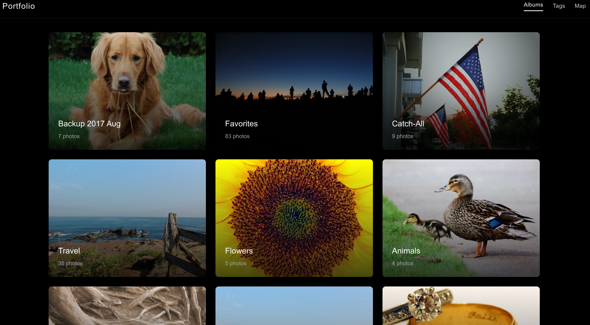
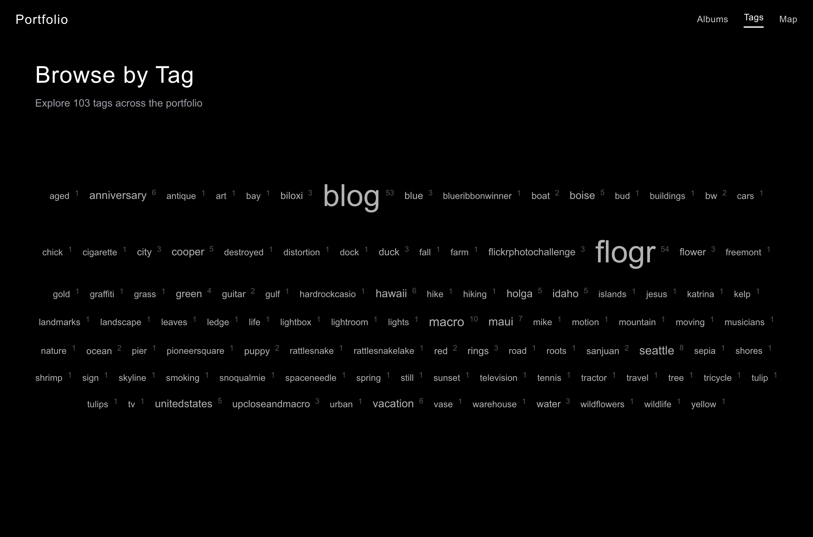
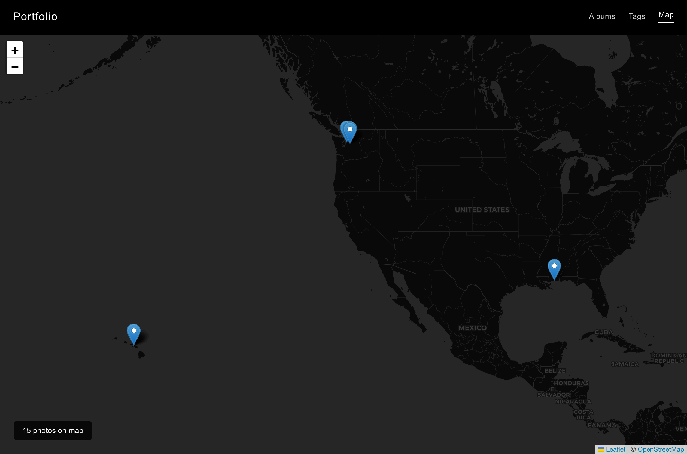
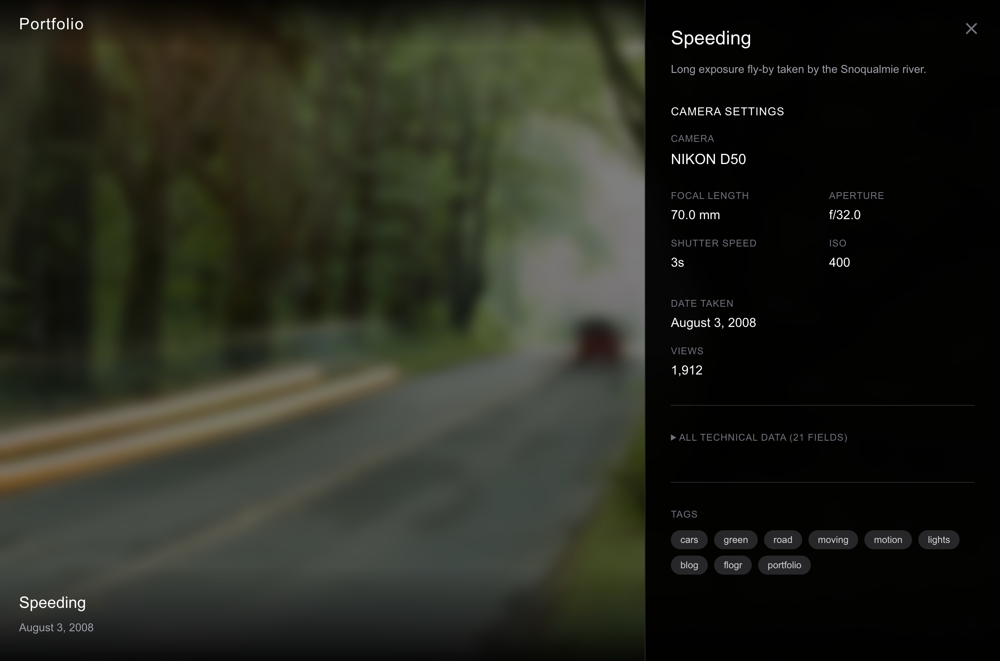

# Flickr Portfolio

**Turn your Flickr photos into a stunning professional portfolio website.**

A modern, cinematic photography portfolio that automatically syncs with your Flickr account. Upload photos to Flickr, tag them as "portfolio", and they instantly appear on your website. No manual uploading, no databases, no hassle.

[Sample Portfolio](https://www.theunmarkedroad.com/)

## 📸 Screenshots

<div align="center">

### Gallery View


### Album Cloud


### Tag Cloud


### Map View


### Photo Details


</div>

## ✨ What You Get

- **🖼️ Full-Screen Gallery** - Dramatic, immersive photo display with smooth transitions
- **📁 Album Organization** - Browse your work by Flickr albums
- **🏷️ Tag Filtering** - Explore photos by tag with an interactive tag cloud
- **🗺️ Map View** - See all your geotagged photos on an interactive map
- **📸 EXIF Data** - Display camera settings, lens info, and technical details
- **📱 Mobile Friendly** - Swipe gestures and responsive design
- **⚡ Always in Sync** - Updates automatically when you add photos to Flickr
- **🎨 Professional Design** - Clean, dark aesthetic that puts your photos first

## 🎯 Perfect For

- Photographers wanting a professional portfolio website
- Flickr users who want more control over how their work is presented
- Anyone who wants a beautiful photo site without managing a CMS

## 🚀 Quick Start (No Coding Required)

### Step 1: Get Your Flickr API Key

1. Go to [Flickr App Garden](https://www.flickr.com/services/apps/create/apply/)
2. Click **"Request an API Key"**
3. Choose **"Apply for a Non-Commercial Key"**
4. Fill in:
   - **App Name**: "My Portfolio" (or your name)
   - **Description**: "Personal photography portfolio website"
5. Click **"Submit"**
6. Save your **API Key** and **API Secret** (you'll need these later)

### Step 2: Find Your Flickr User ID

1. Go to [idGettr](https://www.webfx.com/tools/idgettr/)
2. Enter your Flickr profile URL (like `flickr.com/photos/yourname`)
3. Copy your **User ID** (looks like `12345678@N01`)

### Step 3: Deploy Your Site

Choose one of these platforms (all have free tiers):

#### Option A: Vercel (Recommended - Easiest)

1. Fork this repository on GitHub
2. Go to [vercel.com](https://vercel.com) and sign up
3. Click **"Import Project"** and select your forked repository
4. Add these **Environment Variables**:
   ```
   NEXT_PUBLIC_FLICKR_API_KEY=paste_your_api_key_here
   NEXT_PUBLIC_FLICKR_API_SECRET=paste_your_api_secret_here
   NEXT_PUBLIC_FLICKR_USER_ID=paste_your_user_id_here
   ```
5. Click **"Deploy"**
6. Done! Your site will be live at `your-project.vercel.app`

#### Option B: Netlify

1. Fork this repository on GitHub
2. Go to [netlify.com](https://netlify.com) and sign up
3. Click **"Add new site"** → **"Import an existing project"**
4. Select your forked repository
5. Build settings:
   - **Build command**: `npm run build`
   - **Publish directory**: `.next`
6. Add **Environment Variables** (same as above)
7. Click **"Deploy"**

#### Option C: Railway

1. Fork this repository on GitHub
2. Go to [railway.app](https://railway.app) and sign up
3. Click **"New Project"** → **"Deploy from GitHub repo"**
4. Select your forked repository
5. Add **Environment Variables** (same as above)
6. Railway will automatically deploy your site

### Step 4: Add Photos to Your Portfolio

1. Upload photos to Flickr (as you normally do)
2. Tag photos with **"portfolio"** to include them
3. (Optional) Add photos to albums for album browsing
4. (Optional) Add location data for map view
5. Photos appear on your site automatically! 🎉

## 📖 How to Use Your Portfolio

### For You (Managing Content)

**Adding Photos:**
- Upload to Flickr and tag with `portfolio`
- Photos appear instantly (no rebuild needed)

**Organizing:**
- Create albums on Flickr to group related work
- Use tags to categorize photos (travel, portraits, etc.)
- Add geotags for photos to appear on the map

**Removing Photos:**
- Remove the `portfolio` tag on Flickr
- Photo disappears from your site automatically

### For Your Visitors (Viewing)

- **Home** - Full-screen slideshow of your portfolio
- **Albums** - Browse photos organized by album
- **Tags** - Explore by tag (landscape, portrait, etc.)
- **Map** - See where photos were taken (for geotagged images)
- **Details** - Click any photo to see camera settings and EXIF data

**Navigation:**
- Arrow keys or swipe to move between photos
- Click navigation arrows on desktop
- Press `E` to toggle technical details
- Press `ESC` to go back

## 🎨 Customization

### Adding Your Own Domain

**On Vercel:**
1. Go to your project settings
2. Click **"Domains"**
3. Add your custom domain (like `photos.yourname.com`)
4. Update your domain's DNS settings as instructed

**On Netlify/Railway:** Similar process in their domain settings

### Changing the Look

The portfolio has a dark, cinematic aesthetic by default. To customize:

1. Clone the repository to your computer
2. Edit files in the `app/` and `components/` folders
3. Push changes to GitHub
4. Your hosting platform will auto-deploy updates

(Requires some basic coding knowledge - or ask a developer friend!)

## ❓ Troubleshooting

### My photos aren't showing up

- ✅ Make sure photos are **public** on Flickr (not private)
- ✅ Check they're tagged with **"portfolio"** (all lowercase)
- ✅ Verify your User ID is correct
- ✅ Wait a minute and refresh (it fetches from Flickr's API)

### The map is empty

- ✅ Make sure photos have location data on Flickr
- ✅ Check that geotagged photos also have the "portfolio" tag
- ✅ Privacy note: The app only shows city-level location, not exact GPS

### Deployment failed

- ✅ Double-check environment variables are set correctly
- ✅ Make sure you copied the entire API key (no spaces)
- ✅ Try redeploying after fixing variables

### Getting API errors

- Free Flickr API allows 3,600 requests/hour - plenty for a portfolio
- If you hit limits, wait an hour and try again
- Check the browser console (F12) for specific error messages

## 🛠️ For Developers

### Tech Stack

- **Next.js 16** - React framework with App Router
- **TypeScript** - Type-safe development
- **Tailwind CSS 4** - Utility-first styling
- **Framer Motion** - Smooth animations
- **Leaflet** - Interactive maps
- **Flickr API** - Content backend

### Local Development

```bash
# Clone the repository
git clone https://github.com/yourusername/flickr-portfolio-nextjs.git
cd flickr-portfolio-nextjs

# Install dependencies
npm install

# Create environment file
cp .env.local.example .env.local

# Add your Flickr credentials to .env.local

# Run development server
npm run dev

# Open http://localhost:3000
```

### Project Structure

```
flickr-portfolio-nextjs/
├── app/
│   ├── page.tsx              # Home gallery
│   ├── albums/               # Album pages
│   ├── tags/                 # Tag filtering pages
│   ├── map/                  # Map view
│   └── photo/[id]/           # Photo detail with EXIF
├── components/
│   ├── PhotoGallery.tsx      # Main gallery component
│   └── MapView.tsx           # Map component
├── lib/
│   └── flickr.ts             # Flickr API client
└── .env.local                # Your credentials (gitignored)
```

### API Integration

Uses these Flickr API methods:
- `flickr.photos.search` - Find portfolio photos
- `flickr.photos.getInfo` - Get metadata
- `flickr.photos.getExif` - Get camera settings
- `flickr.photosets.getList` - Get albums
- `flickr.photosets.getPhotos` - Get album photos

## 💡 Tips & Best Practices

1. **Curate carefully** - Only tag your best work as "portfolio"
2. **Use albums** - Group related photos for better organization
3. **Add descriptions** - Flickr descriptions appear on detail pages
4. **Tag thoughtfully** - Tags become browsable categories
5. **Geotag when relevant** - Makes the map view more interesting
6. **Keep photos public** - Private photos won't appear
7. **High-quality images** - Upload your best resolution

## 📝 License

MIT License - Use this however you'd like!

## 🙏 Credits

Originally inspired by [Flogr](https://github.com/mcarruth/flogr) - A PHP-based Flickr portfolio from the early days of the Flickr API.

Built with modern tools: Next.js, TypeScript, Tailwind CSS, Framer Motion, and Leaflet.

## 🤝 Contributing

Found a bug? Have an idea? Pull requests welcome!

## 📬 Questions?

Open an issue on GitHub or reach out to the community.

---

**Made by photographers, for photographers.** 📷
